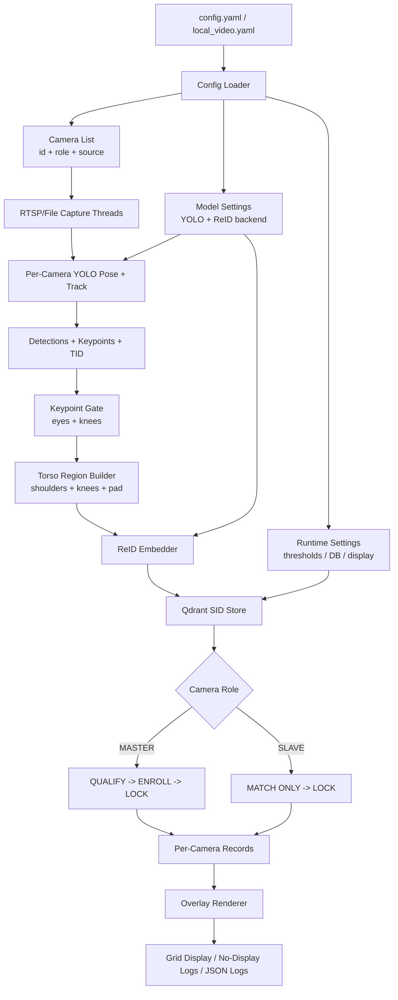

# CrossCamReid

Production-grade, configurable dual-camera person ReID app based on `rtsp_infer_v2`, with optional TensorRT acceleration for ReID embedding inference.

## What Was Carried Over From `rtsp_infer_v2`

This implementation preserves all core behaviors from your existing app:

- Dual-source processing: CAM1 as `MASTER`, CAM2 as `SLAVE`.
- YOLO pose + tracking (`.track()` with ByteTrack).
- Same keypoint gate logic:
  - Requires both eyes and both knees.
- Same torso-region embedding logic:
  - Uses shoulders + knees to build ReID crop region.
  - Region padding is configurable.
- Same identity lifecycle in master stream:
  - `QUALIFY -> ENROLL -> LOCK`.
- Same slave behavior:
  - Match-only, never writes new IDs.
- Same local Qdrant vector DB workflow:
  - Optional fresh DB wipe per run.
- Same visual overlays:
  - Person box, torso region box, keypoint markers, phase text.
- Same optional no-display and JSON logging modes.

## New Improvements

- Config-driven architecture via YAML.
- Production-oriented folder layout (`production` + `localtest`).
- ReID backend switch through config:
  - `onnxruntime`
  - `tensorrt` (engine file based)
- Scalable modular codebase:
  - capture, config, processor, store, overlay, pipeline, reid backends.

## Pipeline Architecture Diagram



## Folder Structure

```text
CrossCamReid/
  README.md
  requirements.txt
  production/
    app.py
    config/
      config.yaml
    src/
      crosscamreid/
        __init__.py
        capture.py
        config.py
        keypoints.py
        overlay.py
        pipeline.py
        processor.py
        state.py
        store.py
        reid/
          __init__.py
          base.py
          factory.py
          onnx_backend.py
          tensorrt_backend.py
  localtest/
    run_localtest.py
    run_localtest.ps1
    config/
      local_video.yaml
```

## Install

```powershell
cd CrossCamReid
python -m pip install -r requirements.txt
```

For TensorRT mode, install TensorRT runtime and `pycuda` in the same environment.

## Run

### Production

```powershell
cd CrossCamReid\production
python app.py --config .\config\config.yaml
```

### Local Test

```powershell
cd CrossCamReid\localtest
python run_localtest.py --config .\config\local_video.yaml
```

or:

```powershell
.\run_localtest.ps1
```

## Config Reference

Both `production/config/config.yaml` and `localtest/config/local_video.yaml` use the same schema.

### `sources`

- `master`: CAM1 source (RTSP, file path, or camera index string).
- `slave`: CAM2 source (RTSP, file path, or camera index string).

### `models`

- `pose_path`: YOLO pose weights path.
- `reid_onnx_path`: ONNX ReID model path.
- `reid_tensorrt_engine_path`: TensorRT engine file path (`.engine`), required only when `runtime.reid_backend=tensorrt`.

### `capture`

- `buffer_size`: OpenCV capture buffer size.
- `reconnect_initial_delay_sec`: Initial reconnect wait.
- `reconnect_max_delay_sec`: Maximum reconnect wait.
- `max_read_failures`: Consecutive read failures before reconnect.

### `gating`

- `person_conf_thresh`: YOLO person confidence threshold.
- `keypoint_conf_thresh`: Keypoint visibility threshold.
- `match_thresh`: SID acceptance threshold from Qdrant cosine score.
- `min_region_side`: Minimum side length of torso region crop.
- `region_pad_frac`: Padding around torso region box.
- `max_embeddings_per_sid`: Max vectors stored per SID.

### `enrollment`

- `qualify_frames`: Required unmatched valid frames before minting new SID.
- `enroll_frames`: Number of embeddings gathered for new SID.

### `database`

- `path`: Local Qdrant DB directory.
- `collection`: Qdrant collection name.
- `keep_db`: If `false`, DB folder is wiped at startup.

### `runtime`

- `tracker`: Ultralytics tracker config (for example `bytetrack.yaml`).
- `reid_backend`: `onnxruntime` or `tensorrt`.
- `no_display`: Run without OpenCV window output.
- `display_width`: Side-by-side output width.
- `log_json`: Print per-frame JSON logs.

## TensorRT Mode

1. Build or export a TensorRT engine for the ReID model externally.
2. Set:
   - `runtime.reid_backend: "tensorrt"`
   - `models.reid_tensorrt_engine_path: "path/to/reid.engine"`
3. Keep `models.reid_onnx_path` for fallback convenience.

The backend switch is runtime-configurable, so no code changes are needed.

## Production Notes

- Use separate configs per environment (dev/staging/prod).
- Keep camera credentials outside git-tracked config in secure deployment.
- Persist Qdrant path on durable storage in production.
- For high throughput, keep GPU drivers, CUDA, TensorRT, and model formats aligned.
- If you need strict reproducibility, pin exact package versions.
