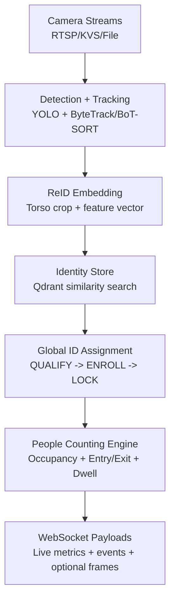

# CrossCamReID

> Real-time **People Counting + Re-Identification** for multi-camera edge analytics.


## What This App Does

`production/app_people_counting.py` runs a live analytics pipeline that:

- Detects and tracks people per camera.
- Re-identifies the same person across cameras with global IDs.
- Computes occupancy, entry/exit flow, and dwell time.
- Streams results in real time over WebSocket for dashboards.

## Why It Feels Enterprise-Ready

- Cross-camera ID consistency using shared ReID identity memory.
- Config-driven behavior (`YAML`) for controlled deployments.
- Multiple backend options (`onnxruntime`, `tensorrt`, `fastreid`).
- Built-in health endpoint and session lifecycle handling.
- Designed for benchmark-oriented edge inference pipelines.

## Architecture (Abstract View)



## Core Features

- Real-time people counting per camera and organization.
- Cross-camera re-identification with stable person IDs.
- Occupancy analytics and threshold alert support.
- Dwell-time analytics (including cross-camera lifetime dwell).
- Occlusion-aware embedding control to reduce ID pollution.
- Tracker mode switch: `bytetrack` or `botsort`.
- Session-aware WebSocket server with token support.

## Get Started

### 1) Install dependencies

```bash
pip install -r requirements.txt
```

Optional extras:

- `pip install PyJWT` (strict JWT validation)
- `pip install boto3` (`kvs://` stream support)
- `pip install pynvml` (GPU stats in payload)

### 2) Configure the app

Edit:

- `production/config/config.yaml`

Key sections to verify:

- `cameras`
- `models`
- `database.qdrant`
- `runtime.reid_backend`
- `runtime.tracker_mode`

### 3) Run the People Counting + ReID server

```bash
cd production
uvicorn app_people_counting:app --host 0.0.0.0 --port 8002
```

### 4) Connect your client

WebSocket endpoint:

```text
ws://<host>:8002/ws/people_counting/{client_id}?token=<JWT-or-dev-token>
```

Health check:

```text
GET http://<host>:8002/health
```

## Quick Repo Map

```text
production/
  app_people_counting.py               # Main people-counting + ReID app
  dashboard_people_counting_mock.html  # Sample dashboard UI
  config/config.yaml                   # Runtime configuration
  src/crosscamreid/
    websocket/people_counting_handler.py
    websocket/people_counting_runner.py
    counting/                          # occupancy, dwell, entry/exit logic
    reid/                              # ONNX/TensorRT/FastReID backends
```

## Typical Use Cases

- Retail occupancy intelligence
- Campus/building movement analytics
- Entrance/exit flow monitoring
- Multi-camera people insights dashboards

## Notes

- Keep camera credentials and secrets outside git-tracked files.
- Use separate config files for dev, staging, and production.
- For benchmark reporting, fix hardware, camera layout, and config version.
